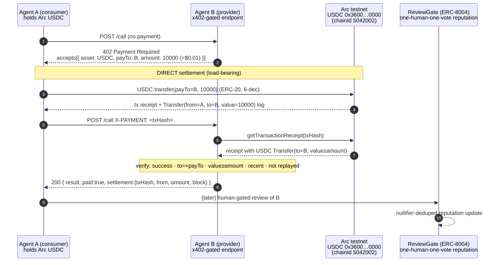

# HumanRank × Arc — Agentic Economy on Circle's Arc testnet

> Target prize: **Best Agentic Economy with Circle Agent Stack** — agents transacting with each
> other via USDC nanopayments on Arc.

HumanRank gates ERC-8004 reputation by World ID (one human, one vote). The **Arc track** makes the
pay-per-call layer real: when an agent's free trial is exhausted, the consumer **pays the provider
in USDC on Circle's Arc testnet** and the provider verifies the on-chain settlement before serving.
Two agents transact with each other in stablecoin nanopayments, and the payment is the access
control.

## The agent-to-agent USDC flow



### Two settlement paths

| Path | Status | How it settles | Where |
| --- | --- | --- | --- |
| **DIRECT USDC transfer** | **LOAD-BEARING** (verified) | Consumer sends a USDC ERC-20 `transfer` to `payTo` on Arc; provider fetches the receipt and confirms the `Transfer(from, to=payTo, value≥amount)` log on the USDC proxy, recent + not replayed. | `backend/src/arcSettlement.ts`, `scripts/agent-to-agent.ts` |
| **Circle Gateway** | DEMONSTRATIVE | `gateway.pay(url, …)` via `@circle-fin/x402-batching` — EIP-3009 `transferWithAuthorization`, batched, **Circle pays the batch gas**, settles in USDC on Arc. | `backend/src/arcGateway.ts`, `scripts/agent-to-agent.ts --gateway` |

The DIRECT path is the one we verify end-to-end and that the backend relies on. The Gateway path is
wired through Circle's official SDK and attempted first when `--gateway` is passed, falling back to
DIRECT on any SDK/balance failure. It is lazy-imported and try/catch-wrapped so a flaky SDK never
breaks the server or the demo.

## Circle tools used (Circle Agent Stack)

- **USDC on Arc testnet** — `0x3600000000000000000000000000000000000000`. It is **both** the native
  gas token (18-dec, `msg.value`/`getBalance`) **and** an ERC-20 (6-dec, `balanceOf`/`transfer`/
  `Transfer`). Conversion: `1 USDC = 1e6 ERC-20 units = 1e18 native units`. Our nanopayments settle on
  the ERC-20 `Transfer` event; gas is auto-deducted from the same USDC balance (**USDC-as-gas**).
- **Circle Nanopayments / x402** — the 402→pay→retry handshake is x402-shaped. The 402 `accepts[]`
  advertises `{ scheme:"exact", network:"arc-testnet", chainId:5042002, asset:<USDC>, payTo, maxAmountRequired }`.
  Prices are sub-cent ($0.01 default) — true nanopayments.
- **Circle Gateway** — facilitator for batched, gas-abstracted settlement. SDK
  `@circle-fin/x402-batching@3.0.4`: server `BatchFacilitatorClient` (`/server`), client
  `GatewayClient({ chain:"arcTestnet", privateKey })` (`/client`). GatewayWallet on Arc testnet:
  `0x0077777d7EBA4688BDeF3E311b846F25870A19B9` (EIP-712 domain `GatewayWalletBatched` v1). The SDK's
  x402 network identifier for Arc is the CAIP-2 form **`eip155:5042002`** (our DIRECT 402 uses the
  human-readable `arc-testnet`).

## Arc deployment

`contracts/script/DeployArc.s.sol` deploys ReviewGate + the mock ERC-8004 registries to Arc testnet
and writes `shared/addresses.arc.json` (parallel to `addresses.local.json`, plus `chainId:5042002`,
the Arc `rpcUrl`, a top-level `usdc`, and a per-agent Arc `payTo`).

```bash
# Real Arc testnet (deployer must hold faucet USDC — it pays gas in USDC):
forge script script/DeployArc.s.sol:DeployArc \
  --rpc-url https://rpc.testnet.arc.network --broadcast --private-key <FUNDED_PK>

# Faucet: https://faucet.circle.com  (Arc Testnet, 20 USDC / 2h, no account)
```

The backend reads `addresses.arc.json` when launched with `PAYMENTS=arc`.

## Running the agent-to-agent demo

```bash
# 1. Fork Arc locally (USDC is the native token on the fork):
anvil --fork-url https://rpc.testnet.arc.network --port 8547 --silent &

# 2. Prepare the fork so the real USDC ERC-20 Transfer path is exercisable (see note below):
cd contracts && forge build
cd ../scripts && ARC_RPC_URL=http://127.0.0.1:8547 npx tsx arc-fork-prep.ts

# 3. Run two agents transacting in USDC on Arc:
ARC_RPC_URL=http://127.0.0.1:8547 npx tsx agent-to-agent.ts --price=10000      # $0.01
#  add --gateway to attempt the Circle Gateway path first (falls back to direct)
```

On **real Arc testnet**, skip step 2 (the native USDC precompile is already there); just fund Agent A
from the faucet and run step 3 with `ARC_RPC_URL=https://rpc.testnet.arc.network`.

### Fork caveat (honest)

A vanilla `anvil --fork-url` of Arc does **not** replicate Arc's USDC precompile: at `0x3600…0000`
the forked proxy's `transfer()` reverts and native sends emit no `Transfer` log, so a real ERC-20
`Transfer` cannot be produced through the proxy on the fork. `anvil_setBalance` to native USDC **does**
correctly sync to the 6-dec `balanceOf` (verified: `5e18` native → `balanceOf == 5e6`). To still prove
the settlement-verification logic on the fork, `arc-fork-prep.ts` `anvil_setCode`s a standard 6-dec
ERC-20 (`contracts/src/mocks/MockUSDC.sol`) at `0x3600…0000` so `transfer` emits the canonical
`Transfer(from,to,value)` event — identical to what the real Arc USDC proxy emits on testnet. This is
fork-only plumbing; the production code path (`arcSettlement.ts`) is unchanged and works against real
Arc testnet as-is.
```
